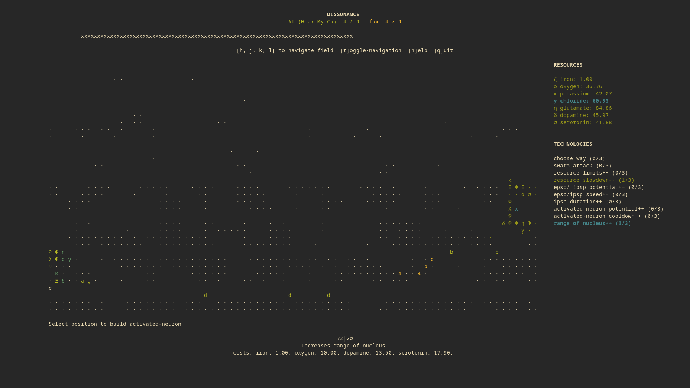
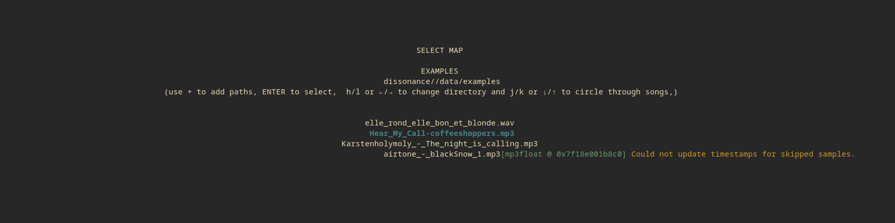

### tl;dr
**Installing**:
```
git clone https://github.com/georgbuechner/dissonance
cd dissonance

# ubuntu:
sudo apt-get install aubio-tools libaubio-dev libaubio-doc

# MacOs and other non-ubuntu linux-distros:
make aubio  

make install
```

**running single-player**:
```
dissonance
```

**running multiplayer**:
```
dissonance -m
```
or for connecting to custom-server
```
dissonance -m -z "ws://<host>:<port>"  
```

# Table of contents
1. [Dissonance](#dissonance)
2. [Premise](#premise)
3. [Installation](#installation)
	1. [Requirements](#requirements)
	2. [Installation](#install)
		- [Quick-guide](#quick-guide)
		- [Detailed installation guide](#detailed-guide)
	1. [Usage](#usage)
	2. [Logfiles](#logfiles)
	3. [Tests](#tests)
	4. [Uninstall](#uninstall)
	5. [Known problems](#known-problems)
  6. [Help Me!](#help-me)
4. [Game details](#game-details)
	1. [Resources](#resources)
	2. [Neurons and potential](#neurons-and-potential)
	3. [Technologies](#technologies)
	3. [Costs](#costs)
5. [Acknowledgements](#Acknowledgements)


## Dissonance 

A command line and keyboard based strategy-game, where audio-input determines the
AI-strategy and lays the seed for the map-generation.

## Premise 
Several parts of the brain are in dissonance and started attacking each other
with strong potentials, aiming to destroy the other's nucleus. 

Each player starts with a nucleus with control over a few cells surrounding it.
By gathering different resources (iron, oxygen, potassium, ...) you can create synapses to 
generate potential, advancing towards the enemy's nucleus. By activating cells 
you control, these cells can neutralize incoming potential.

You randomly gain iron every few seconds. Iron can be used to activate the process of 
gathering new resources or to boost their production. But your resource production is 
also dependent on your current oxygen level and on how close the resource is to it's 
limit. So be careful when building neurons: the more resources are bound in
neurons, the less resources you gain!

Once you started gaining dopamine and serotonin, you can develop advanced
technologies, allowing you to f.e. increase your resource limits or target specific enemy 
neurons and hence destroy enemy synapses or activated neurons or even block the
enemies resource-production.

Once you gained enough resources you can expand your control over the brain by
building more nuclei. Use these, your built potentials and the strategist
inside you to overcome dissonance in your favor!

## Installation 

### Requirements 
- C++ compiler:  
  Linux: [gcc](https://gcc.gnu.org/) (available in most package managers),   
  MacOs: [clang](https://clang.llvm.org/) (available with `brew install clang`)  
- essential commandline tools, like `wget`
- essential c++ tools like `make` and `cmake`.
- [python](https://www.python.org/) 
- [conan](https://conan.io/) (available in most package managers, but also: `pip install conan`)
- [aubio](https://github.com/aubio/aubio) (installation instructions below)

Aubio installation: 
- Ubuntu: `sudo apt-get install aubio-tools libaubio-dev libaubio-doc`  
- For other linux distros and MacOs a `make aubio` step is included in this project
- If none of the above is working for you, checkout the official aubio-download page: 
  https://aubio.org/download

You might also need to install some media libraries to play audio which is not in `.wav` 
format. So if loading `.mp3` files or other audio-files like `.ogg` is not
working for you, please refer to the
[aubio-documentation](https://aubio.org/manual/latest/installing.html#external-libraries)
(however at least `.wav` and `.mp3` should work if the installation was successful).


### Installation<a name="install"></a>

#### Quick-quide<a name="quick-guide"></a>
```python
git clone https://github.com/georgbuechner/dissonance
cd dissonance

# ubuntu:
sudo apt-get install aubio-tools libaubio-dev libaubio-doc

# MacOs and other linux-distros:
make aubio  

make install
```

#### Detailed installation quide<a name="detailed-guide"></a>

Clone project: 
```
git clone https://github.com/georgbuechner/dissonance
```

Now `cd` into the project
```
cd dissonance
```

If *aubio* is not available in your systems package-manager, build *aubio* from
source:
```
make aubio
```
In case you experience the error `/usr/bin/env: ‘python’: No such file or directory`:
- Check if `python` is correctly installed. 
- If `python3` is installed, you may want to create a symlink with the following
  command: `sudo ln -sf /usr/bin/python3 /usr/bin/python`

Finally you install *dissonance* by running:
```c
make install  
```

These steps install `dissonance` system-wide and create `.dissonance` in the home folder to
store settings and analysed musical data.

### Usage
To play, simply run `dissonance` in your command line for singe-player and
`dissonance -m` to play online (multiplayer), which will automatically connect
you to our server. You may also connect to a custom server with  
`dissonance -m -z "ws://{server-name}:{port}"`. 

You can run your own server by adding `-s` flag (or: `--standalone`).
`4444` is the standard port, you can change by adding the `-p` flag (or: `--port`)

You should open your terminal in full screen mode. Technically any terminal-size
is possible, but the game is only really tested for *1900x1020* and *3440x1440*.

### Update 
If a update is availible first run:
```
git pull 
``` 
To get the most recent source-code, then run:
```
make install 
```

If you're playing in mutli-player mode you will be informed if a update is
availible.


### Logfiles

If not changed manually, logfiles will be stored at `~/.dissonance/logs/` in the
format `[timestamp]_logfile.txt` f.e. `2021-10-13-01-44-47_logfile.txt`.

By default all previous logs are deleted whenever starting a new game. This behavior 
can be changed, adding `-k` or `--keep_log` flag.

By default logging is set to `warn`, leading to very small log-files containing only
the most relevant information. Consider including these files if you are filing
an issue. You may also increase the log-level with `dissonance -l` respectively
`dissonance --log-level` (f.e. `dissonance -l "debug"`). 


### Tests

To run tests, run 
```
./build/bin/tests
```

### Uninstall
To uninstall `dissonance`, run:
```
make uninstall
```

If you installed *aubio* with make, you can uninstall using:
```
make uninstall_aubio
```

### Known problems

#### General Disclaimer 
This is a single-person project and issues may appear. 
If the game crashes while playing, consider filing a bug-report on this github
page and include the log file. 
Also the terminal-command `reset` clears the screen when you experience
corrupted output after a game crash.

#### Conan 
Conan is a great piece of software, however, errors might occurr. 
You should definitly check that your conan version is up to date.

#### MacOs installation: c++ compiler detected by cmake differs from conan profile.

Possible error:
```
CMake Error at conanbuildinfo.cmake:582 (message):
  Incorrect 'gcc', is not the one detected by CMake: 'Clang'
```

Currently it is expected that clang is the primary compiler, when installing
dissonance on MacOs (more specifically: cmake detects clang as compiler).
Thus the conan-profile should also be setup for clang. If this is not the case
(because you f.e. modified the conan default profile) you can revert this, by
running:
```
conan profile new default --detect
```

Of course this can only work, if clang is actually your main c++ compiler (conan
detects clang).

Afterwards re-run `make install`.

It is very likely that it is possible to compiler `dissonance` with gcc on MacOs
also, however, Makefile and CMakeList is not optimised for this, and you main
need to figure some problems out yourself.

#### Audio glitching/ noise on Arch Linux. 
As the documentation of [miniaudio](https://miniaud.io/docs/manual/index.html) 
correctly points out, these issues might be fixed by applying the fix mentioned
in the arch-linux wiki: https://wiki.archlinux.org/title/PulseAudio/Troubleshooting#Glitches,_skips_or_crackling.

#### Loading audio
What you see in the image below is not an error! It's indicating that audio is
being analysed. Once you analysed the song once, the data is stored and the
message should not aprear again.


## Help Me I have no idea what a command-line is.<a name="help-me"></a>
Okay I think it's worth writing a few lines about the command-line and giving a
few instructions in case you never used a *terminal* or a *command-line* and
especially give some help on installing the requirements.

If you really have now idea at all, I strongly advise checking out a few
tutorials, here is f.e. the link to the official ubuntu-command-line-tutorial:
https://ubuntu.com/tutorials/command-line-for-beginners#3-opening-a-terminal

### Opening the command-line.
You can usually open the command-line (CLI) by searching *terminal* via your
systems build-in search method. 

### Basic commands
There are a few commands you will probably need during the installation process,
let's take a look. (All of the following commands are identical on linux and
MacOs.)

The `pwd` command shows the path of you current working directory
```
pwd
 
# possible output:
/home/sigmund/Documents
```

The `ls` command shows all files and directories in the current folder
```
ls

# possible output:
Documents
Downloads
Pictures
Music
```

With `mkdir` (make directory) you can create a new directory/ "folder":
```
mkdir build
```

`ls` will then show the newly created directory:
```
ls

# possible output:
Documents
Downloads
Pictures
Music
build
```

`cd` allows you to change the current working directory:
```
cd build
```


### Installing software via CLI
Installing new software via CLI is one of the things that will give you the "oh, that's
nice" experience. Most operating systems (we'll concentrate on linux and MacOs
here) will have their own package-manager to not only install but also update
your software. Ubuntu uses `apt`, arch-bases distro use `pacman` and on MacOs
you can use `homebrew`. Installing howebrew can be a bit tricky, here's a link
on how to do this: https://brew.sh/

To play dissonance, you will need to install a few programs, let's take a look 

#### Ubuntu
As already mention, ubuntu uses `apt`. 

For dissonance you need to install a few programs, like `gcc`, `cmake`, `python` and
`conan` and maybe (depending on what is already installed on you system, more
basic tools, like `make`, `wget` and other programs. This may seem like a lot,
but installing via CLI really makes things easy: 
```
sudo apt install build-essential cmake python
```
Will install most programs you need to install and run dissonance.

`build-essential` contains standard software for coding, like `gcc` (c++
compiler), `make` and a few other libraries.

On Ubuntu `conan` can not be install via apt, however you can use the
python-package-manager that should be present on your system, once `python` is
installed:
```
pip install conan
```

In general: often if something is going wrong, the command-line will tell you
what the problem is. It might even say `program xxx is missing, you can install
with 'apt install xxx'`.

#### MacOs
Things are quite similar for MacOs: after installing `homebrew` you can install the
necessary software using the command `brew`.

```
brew install cmake make clang python conan
```

I'm aware that this is a very very limited guide focusing only on commands, that
might be needed during the installation process. However I hope these few lines 
might have helped you to install `dissonance`. Let me know if you have any other
issues. 

## Game Details 

### Resources 
Resources all follow a certain structure: 
- `free`: currently available units of resource.
- `bound`: units bound in certain neurons (in case of iron: all iron distributed to resources).
- `limit`: max resource limit. 
- `boost`: distributed iron to this resource.

In game, when a resource is selected you should see something like this:
<p align="center"> potassium: 50.99+13.20/100 ++2 </p>

This means you have `50.99` potassium free to spend, `13.20` bound in neurons,
the current limit for potassium is `100` and boost is `2` (e.i. two iron
distributed to potassium).

The gain of resources is determined by the amount of iron distributed to a
resource, the current oxygen and how close the resource is to it's limit. Iron
basically follows the same system, only that it has a constant boost factor and
is only generated when certain notes are played (more accurately: when in a
certain frame only notes outside of the key where played - *high dissonance*).
In addition, the slowdown factor reduces the current gain, this provides the
option to reduce the slowdown curve with technologies.

Formula: `(boost * gain * negative-faktor) / slowdown` where...
- ...boost is calculated with `1 + boost/10`
- ...gain is calculated with `|log(current-oxygen+0.5)|`
- ...negative-factor is calculated with `1 - (free+bound)/limit`
- ...slowdown is `3` when game starts and can be reduced up to `0.5` with technologies.


| name        | group   |
|:-----------:|:-------:|
| iron (ζ) | Resources |
| oxygen (ο) | Resources/ Production |
| potassium (κ) | Attack | 
| chloride (γ) | Attack |
| glutamate (η) | Defence |
| dopamine (δ) | Technologies | 
| serotonin (σ) | Technologies |
-------------------------------------

### Neurons and Potential
| name            | group   | description   | costs   | 
|:---------------:|:-------:|---------------| ------- |
| nucleus (Χ)     | expansion | nucleus from which everything is controlled. | ζ, ο, κ, γ, η, δ, σ |
| activated neuron (Φ) | defence/ neuron | activates a cell, thus reducing the potential of incoming EPSP or IPSP. | ο, η | 
| Synapse (Ξ)  | attack/ neuron  | creates potential (epsp, ipsp). | ο, κ | 
| [a..z] epsp            | attack/ potential | potential traveling to enemy neurons, aiming to *destroy* these. | κ | 
| [1..9] ipsp            | attack/ potential | potential traveling to enemy neurons, aiming to *block* these or enemy epsp. | κ, γ | 
| 0 macro | attack/ potential | a "special" unit which can either inflict range-damage or create "loophols" for faster movement of potentials (function randomly assigned when game starts) | κ, γ | 


### Technologies
Most technologies are automatically applied. In the case of the technologies
belonging to the group *attack*, new technologies allow you to change the
configuration of you synapses. These configurations can be different for each
synapse (e.i. potentials launched from different synapses can go different ways and have
different targets -- targets for epsp and ipsp can also be selected independent
from each other).
Each technology has three steps. The second step doubles, the third triples the cost for the technology.

| name            | group | description   | steps |
|:---------------:|------|--------| ------ |
| choose way | attack | specify way-points to plan your attacks more accurately | 3 (1, 2, 3 way-points) |
| swarm attack | attack | synapse release a "swarm" of epsps | 3 (4, 7, 10) |
| total resources | resources | increases maximum of each resource by 20% | 3 |
| slowdown curve | resources | lowers resource-slowdown | 3 |
| epsp/ipsp potential | potential-upgrade | increases potential of ipsp and epsp |  3|
| epsp/ipsp speed | potential-upgrade | increases speed of ipsp and epsp | 3 |
| ipsp duration | potential-upgrade | enemy neurons are blocked for a longer time | 3 |
| activated-neuron potential | activated-neuron upgrade| increases potential-slowdown | 3|
| activated-neuron speed | activated-neuron upgrade| increase speed of triggered slowdown| 3|
| nucleus range | expansion | increases range of all controlled nucleus' | 3 |


### Costs

In general the costs are applied to the `free` units of each resource. For the
following entries, in addition the costs are added to the `bound` field:
- nucleus
- activated neuron
- synapse

For the following technologies/ neurons the costs are increased:
- technologies: `costs = costs*cur-step`
- nucleus: `costs = costs*(number-of-nucleus)`

| name    | iron | oxygen | potassium | chloride | glutamate | dopamine | serotonin |
|:--------|------|--------|-----------|----------|-----------|----------|-----------|
| Neuron: nucleus | 1 |8.2| 8.2       | 8.2      | 8.2       | 16.4     | 16.4      |
| Neuron: activated neuron | - | 8.9 | - | -     | 19.1      | -        | -         |
| Neuron: synapse | - | 13.4 | 6.6    | -        | -         | -        | -         | 
| Potential: epsp | - | - | 4.4       | -        | -         | -        | -         |
| Potential: ipsp | - | - | 3.4       | 6.8      | -         | -        | -         |
| Potential: macro| - | - | 25        | 25       | -         | -        | -         |
| Tech: choose way | 1 | -| -         |-         | -         | 17.7     | -         |
| Tech: swarm      | 1 | -| -         |-         | -         | 19.9     | -         |
| Tech: target     | 1 | -| -         |-         | -         | 16.5     | -         |
| Tech: total resources | 1 | -| -    |-         | -         | 18.5     | 17.9      |
| Tech: slowdown   | 1 | -| -         |-         | -         | 21.0     | 21.2      |
| Tech: epsp/ipsp potential| 1 |-| 10 |-         | -         | 16.0     | 11.2      |
| Tech: epsp/ipsp speed    | 1 |-| 10 |-         | -         | 19.0     | 13.2      |
| Tech: ipsp duration      | 1 |-| 10 |-         | -         | 17.5     | 12.2      |
| Tech: activated-neuron potential | 1| - | - |  | 15.9      | 14.5     | 17.6      |
| Tech: activated-neuron speed | 1 | -| - | -    | 15.9      | 16.5     | 6.6       |
| Tech: nucleus range | 1 | 10 | -    | -        | -         | 13.5     | 17.9      |


## Acknowledgements

### Dependencies
I explicitly want to thank all the great developers who help write and maintain the
awesome libraries makeing `dissonance` possible:
- [aubio](https://github.com/aubio/aubio) the fantastic library for analysing audio.
- [miniaudio](https://github.com/mackron/miniaudio), which grants the possibility
  to acctually *play* audio-files. 
- [lyra](https://github.com/bfgroup/Lyra) the beautiful command line argument
  parser.
- [catch2](https://github.com/catchorg/Catch2) (although I apologize for not
  having written enough tests for this project so far!)
- [nlohmann/json](https://github.com/catchorg/Catch2), the insanely good
  json-library (which probably everyone is using?)
- [spdlog](https://github.com/catchorg/Catch2), a great logging library.
- [fiboheap](https://github.com/beniz/fiboheap) for providing an easy to use impementation 
  of the fibonacci heap (I modified the fibonacci-queue-implementation to meet my needs).
- [websocketpp](https://github.com/zaphoyd/websocketpp/blob/master/COPYING) for
  providing the socket communication for multiplayer-mode.
- [msgpack](https://github.com/msgpack/msgpack-c) for it's fast and efficient
  binary serialization!
- and finally [ncurses](https://github.com/mirror/ncurses)! 

Also I want to clarify, that not all dependencies use the same license as I:

| name | license |
|------|---------|
| aubio | GPL-3.0 License |
| miniaudio | Public Domain or MIT |
| lyra | BSL |
| catch2 | BSL |
| nlohmann | BSL |
| spdlog | BSL |
| ncurses | X11 |
| fiboheap | LGPL-3.0 License |
| websocketpp | custom |
| msgpack-c | BSL |


### Music
- blackSnow by airtone (c) copyright 2021 Licensed under a Creative Commons Attribution (3.0) license. http://dig.ccmixter.org/files/airtone/63513
- The night is calling by Kraftamt (c) copyright 2020 Licensed under a Creative Commons Attribution (3.0) license. http://dig.ccmixter.org/files/Karstenholymoly/62739 Ft: mwic
- Hear my call by coffeeshoppers 
- Elle ronde, elle bon et blonde, Elektro Dschungel 

### Friends and influces

Finally I want to thank Alex for discussing ideas and conspets with me, as
well as coming up with the audio-base AI, Anna who help me develop the
resource-and unit-system and especially get the biology right ;), Dennis who
helped with testing and gave a lot of ideas for the tutorial, and Simon who is
currently helping me to develope a more advanced AI.
